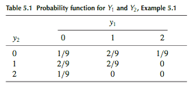
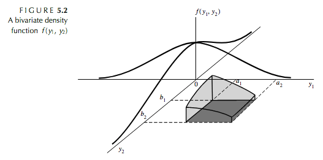
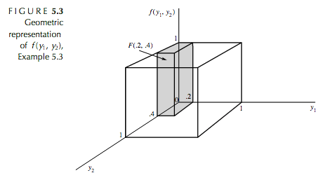
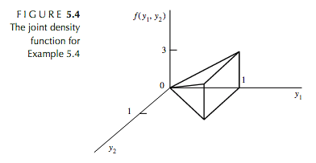
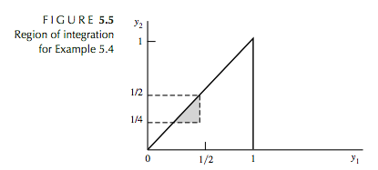
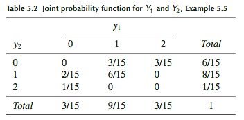
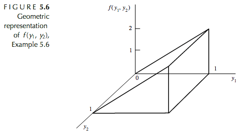

```{r,echo=F, message=F}
library(dplyr)
library(kableExtra)
```

# **Ch. 5 : Multivariate Probability Distributions** 

## **5.2 : Bivariate and Multivariate Probability Distributions** 

Bivariate : involving or depending on two variables 

Multivariate : involving two or more variable quantities 

Consider the experiment of tossing a pair of dice. The sample space contains 36
sample points, corresponding to the mn = (6)(6) = 36 ways in which numbers may
appear on the faces of the dice. Any one of the following random variables could be defined over the sample space and might be of interest to the experimenter:

Y1: The number of dots appearing on die 1.

Y2: The number of dots appearing on die 2.

Y3: The sum of the number of dots on the dice.

Y4: The product of the number of dots appearing on the dice.

The 36 sample points associated with the experiment are equiprobable and correspond to the 36 numerical events (y1, y2). Thus, throwing a pair of 1s is the simple event (1, 1). Throwing a 2 on die 1 and a 3 on die 2 is the simple event (2, 3). For this example the bivariate probability function is : $p(y_1,y_2)=P(Y_1=y_1, Y_2=y_2)=\frac{1}{36},\quad y_1=1,2,3,4,5,6, \text{ }y_2=1,2,3,4,5,6$

> **Definition 5.1** : Let $Y_1$ and $Y_2$ be discrete random variables. The _joint (or bivariate) probability function_ for $Y_1$ and $Y_2$ is given by 
> $$p(y_1,y_2)=P(Y_1=y_1, Y_2=y_2),\quad-\infty <y_1<\infty , -\infty < y_2<\infty$$

> **Theorem 5.1** : If $Y_1$ and $Y_2$ are discrete random variables with joint probability function $p(y_1,y_2)$, then 
>
> 1. $p(y_1,y_2)\geq 0\forall y_1,y_2$
>
> 2. $\sum_{y_1,y_2}p(y_1,y_2)=1$, where the sum is over all values $(y_1,y_2)$ that are assigned nonzero probabilities. 

Calculating joint probabilities involving $Y_1$ and $Y_2$ is straightforward. For the die-tossing experiment, $P(2 \leq Y_1 \leq 3, 1 \leq Y_2 \leq 2)$ is 
$P(2 ≤ Y1 ≤ 3, 1 ≤ Y2 ≤ 2) = p(2, 1) + p(2, 2) + p(3, 1) + p(3, 2)= 4/36 = 1/9$.

**Example 5.1 ** : A local supermarket has three checkout counters. Two customers arrive at the counters at different times when the counters are serving no other customers. Each customer chooses a counter at random, independently of the other. Let $Y_1$ denote the number of customers who choose counter 1 and $Y_2$, the number who select counter 2. Find the joint probability function of $Y_1$ and $Y_2$.

Let the pair $\{i,j\}$ denote the simple event that the first customer chose counter $i$ and the second customer chose counter $j$, where $i,j=1,2,3$. 

Using the $mn$ rule, the sample space consistes of $3\times 3=9$ sample points.

Under the assumption given earlier, each sample point is equally likely and has probability $\frac{1}{9}$. The sample space associated with the experiment is 
$$S=[\{1,1\},\{1,2\},\{1,3\},\{2,1\},\{2,2\},\{2,3\},\{3,1\},\{3,2\},\{3,3\},]$$

Notice the sample point $\{1,1\}$ is the only sample point correspoding to $(Y_1=2,Y_2=0)$ (because it is the only option with a total of 2 people) and hence $P(Y_1=2,Y_2=0)=\frac{1}{9}$. 

Also notice that $P(\{1,2\}$ or $\{2,1\}=\frac{2}{9}$. 

Table 5.1 below contains these probabilities. 



> **Definition 5.2** : For any random variables $Y_1$ and $Y_2$, the joint (bivariate) distribution function $F(y_1,y_2)$ is 
> $$F(y_1,y_2)=P(Y_1\leq y_1, Y_2\leq y_2),\quad \infty < y_1 < \infty, -\infty < y_2 < \infty$$

For two discrete variables $Y_1$ and $Y_2$, $F(y_1,y_2)$ is given by $F(y_1,y_2)=\sum\limits_{t_1\leq y_1}\sum\limits_{t_2\leq y_2} p(t_1,t_2)$

For the dice tossing experiment, 

$F(2,3)=P(Y_1\leq2,Y_2\leq3)=p(1,1)+p(1,2)+p(1+3)+p(2,1)+p(2,2)+p(2,3)$

Because $p(y_1,y_2)=\frac{1}{36}$, then $F(2,3)=\frac{6}{36}=\frac{1}{6}$. 

**Example 5.2** : Consider the random variables $Y_1$ and $Y_2$ from example 1. Find $F(-1,2)$, $F(1.5,2)$, and $F(5,7)$. 

$F(-1,2)=0$

$F(1.5,2)=p(0,0)+p(0,1)+p(0,2)+p(1,0)+p(1,1)+p(1,2)=\frac{8}{9}$

$F(5,7)=P(Y_1\leq 5, Y_2\leq7)=1$

> **Definition 5.3** : Let $Y_1$ and $Y_2$ be continuos random variables with joint distribution function $F(y_1,y_2)$. If $\exists$ a nonegative function $f(y_1,y_2)$, such that 
> $$F(y_1,y_2)=\int_{-\infty}^{y_1}\int_{-\infty}^{y_2}f(t_1,t_2)dt_2dt_1$$
> $\forall -\infty <y_1<\infty$, $-\infty <y_2<\infty$, then $Y_1$ and $Y_2$ are said to be _jointly continuous random variables_. The function $f(y_1,y_2)$ is called the _joint porbability density function_

> **Theorem 5.2** : If $Y_1$ and $Y_2$ are random variables within joint distribution function $F(y_1,y_2)$, then 
>
> 1. $F(-\infty,-\infty)=F(-\infty,y_2)=F(y_1,-\infty)=0$ (smallest possible value is 0)
>
> 2. $F(\infty,\infty)=1$ (largest possible value is 1)
>
> 3. If $y_1^*\geq y_1$ and $y_2^* \geq y_2$ (non-decreasing), then 
> $$F(y_1^*,y_2^*)-F(y_1^*,y_2)-F(y_1,y_2^*)+F(y_1,y_2)\geq 0$$

> **Theorem 5.2** : If $Y_1$ and $Y_2$ are jointly continuous random variable with a joint density function given by $f(y_1,y_2)$, then 
>
> 1. $f(y_1,y_2)\geq 0\forall y_1,y_2$ 
>
> 2. $\int_{-\infty}^{\infty}\int_{-\infty}^{\infty}f(y_1,y_2)dy_1dy_2=1$.



**Example 5.3** : Suppose that a radioactive particle is randomly located in a square with sides of unit length. That is, if two regions within the unit square and of equal area are considered, the particle is equally likely to be in either region. Let $Y_1$ and $Y_2$ denote the coordinates of the particle’s location. A reasonable model for the relative frequency histogram for $Y_1$ and $Y_2$ is the bivariate analogue of the univariate uniform density function : 

\[
f(y_1,y_2)=\begin{cases}
1, & 0\leq y_1\leq 1, 0\leq y_2\leq 1,\\
0, & \text{elsewhere}
\end{cases}
\]

**(a)** Sketch the probaility density surface. 



**(b)** Find $F(.2,.4)$

\begin{equation}\label{5.3b}
\begin{split}
F(.2,.4) & = \int_{-\infty}^{.4}\int_{-\infty}^{.2}f(y_1,y_2)dy_1dy_2\\
& = \int_{0}^{.4}\int_{0}^{.2}(1)dy_1dy_2\\
& = \int_{0}^{.4}(y_1]_0^.2)dy_2\\
& = \int_0^.4.2dy_2\\
& = .08
\end{split}
\end{equation}

**(c)** Find $P(.1\leq Y_1\leq .3, 0\leq Y_2\leq.5)$. 

\begin{equation}\label{5.3c}
\begin{split}
P(.1\leq Y_1\leq .3, 0\leq Y_2\leq.5) & = \int_0^{.5}\int_0^{.3}f(y_1,y_2)dy_1dy_2\\
& = \int_0^{.5}\int_0^{.3}(1)dy_1dy_2\\
& = .10
\end{split}
\end{equation}

This solution can also be obtained with elementary geometry : 

$P(.1\leq Y_1\leq .3, 0\leq Y_2\leq.5)=(.2)(.5)(1)=.10$

**Example 5.4** : Gasoline is to be stocked in a bulk tank once at the beginning of each week and then sold to individual customers. Let $Y_1$ denote the proportion of the capacity of the bulk tank that is available after the tank is stocked at the beginning of the week. Because of the limited supplies, $Y_1$ varies from week to week. Let $Y_2$ denote the proportion of the capacity of the bulk tank that is sold during the week. Because $Y_1$ and $Y_2$ are both proportions, both variables take on values between 0 and 1. Further, the amount sold, $y_2$, cannot exceed the amount available, $y_1$. Suppose that the joint density function for $Y_1$ and $Y_2$ is given by

\[
f(y_1,y_2)=\begin{cases}
3y_1, & 0\leq y_1\leq 1, 0\leq y_2\leq 1,\\
0, & \text{elsewhere}
\end{cases}
\]

Find the probability that less than one-half of the tank will be stocked and more than one-quarter of the tank will be sold. 





\begin{equation}\label{5.4}
\begin{split}
P(0\leq Y_1\leq .5, .25\leq Y_2) & = \int_{1/4}^{1/2}\int_{1/4}^{y_1}3y_1dy_1dy_2\\
& = \int_{1/4}^{1/2}3y_1(y_2]_{1/4}^{y_1})dy_1\\
& = \int_{1/4}^{1/2}3y_1(y_1-1/4)dy_1\\
& = [y_1^3-(3/8)y_1^2]]_{1/4}^{1/2}\\
& = [(1/8) − (3/8)(1/4)] − [(1/64) − (3/8)(1/16)]\\
& = 5/128
\end{split}
\end{equation}

## **5.3 : Marginal and Conditional Probability Distributions**

> **Definition 5.4** : 
>
> (a) Let $Y_1$ and $Y_2$ be jointly discrete random varibales with probaility functions $p(y_1,y_2)$. Then the _marginal probability functions_ of $Y_1$ and $Y_2$, respectively, are given by 
>
> $p_1(y_1)\sum\limits_{\text{all }y_2}p(y_1,y_2)$ and $p_2(y_2)\sum\limits_{\text{all }y_1}p(y_1,y_2)$ 
>
> (b) Let $Y_1$ and $Y_2$ be jointly continuous random variables with joint density function $f(y_1,y_2)$. Then the _marginal density functions_ of $Y_1$ and $Y_2$, respectively, are given by 
>
> $p_1(y_1)\int\limits_{-\infty}^{\infty}f(y_1,y_2)dy_2$ and $p_2(y_2)\int\limits_{-\infty}^{\infty}f(y_1,y_2)dy_1$

- Marginal probability is the probability of an event not taking into account the outcome of another variable

**Example 5.5** : From a group of three Republicans, two Democrats, and one independent, a committee of two people is to be randomly selected. Let $Y_1$ denote the number of Republicans and $Y_2$ denote the number of Democrats on the committee. Find the joint probability function of $Y_1$ and $Y_2$ and then find the marginal probability function of $Y_1$. 

Note the probabilities sought here are similar to the hypergeometric probabilities of Chapter 3. 

$$P(Y_1=1, Y_2=1)=p(1,1)=\frac{{3\choose1}{2\choose 1}{1\choose 0}}{{6\choose2}}=\frac{3(2)}{15}=\frac{6}{15}$$

There are 15 sample points, 1 Rep. of 3, 1 Dem. of 2, and 0 independents. 



To find $p(y_1)$ we must sum over the values of $Y_2$ as Definition 5.4 indicates. 

$p_1(0)=p(0,0)+p(0,1)+p(0,2)=0+\frac{2}{15}+\frac{1}{15}=\frac{3}{15}$

$p_1(1)=\frac{9}{15}$

$p_1(2)=\frac{3}{15}$

**Example 5.6** : Let 

\[
f(y_1,y_2)=\begin{cases}
2y_1, & 0\leq y_1\leq 1, 0\leq y_2\leq 1,\\
0, & \text{elsewhere}
\end{cases}
\]

Sketch $f(y_1,y_2)$ and find the marginal density funcitons for $Y_1$ and $Y_2$. 



- marginal results for $y_1$ would be triangular density

- marginal results for $y_2$ would be uniform density 

For $0\leq y_1\leq1$ :

$f_1(y_1)=\int_{-\infty}^{\infty}f(y_1,y_2)dy_2=\int_0^12y_1dy_2=2y_1(y_2]_0^1)=2y_1$

For $y_1<0$ or $y_1>1$ :

$f_1(y_1)=\int_{-\infty}^{\infty}f(y_1,y_2)dy_2=\int_0^10dy_2=0$

Thus, 

\[
f_1(y_1)=\begin{cases}
2y_1, & 0\leq y_1\leq 1\\
0, & \text{elsewhere}
\end{cases}
\]

For $0\leq y_2\leq1$ :

$f_2(y_2)=\int_{-\infty}^{\infty}f(y_1,y_2)dy_1=\int_0^12y_1dy_1=y_1^2]_0^1=1$

For $y_2<0$ or $y_2>1$ :

$f_2(y_2)=\int_{-\infty}^{\infty}f(y_1,y_2)dy_1=\int_0^10dy_1=0$

Thus, 

\[
f_2(y_2)=\begin{cases}
1, & 0\leq y_1\leq 1\\
0, & \text{elsewhere}
\end{cases}
\]

Note that graphs of $f_1(y_1)$ and $f_2(y_2)$ trace triangular and uniform probability densities respectively, as expected. 

> **Definition 5.5** : If $Y_1$ and $Y_2$ are jointly discrete random variables with joint probability function $p(y_1,y_2)$ and marginal probability functions $p_1(y_1)$ and $p_2(y_2)$, respectively, then the _conditional discrete probability function_ of $Y_1$ given $Y_2$ is 
> $$p(y_1|y_2)=P(Y_1=y_1|Y_2=y_2)=\frac{P(Y_1=y_1,Y_2=y_2)}{P(Y_2=y_2)}=\frac{p(y_1,y_2)}{p_2(y_2)}$$
> provided that $p_2(y_2)>0$

Note : $p(y_1|y_2)$ is _undefined_ if $p_2(y_2)=0$

**Example 5.7 ** : Refer to Example 5.5 and find the conditional distribution of $Y_1$ given that $Y_2 = 1$. That is, given that one of the two people on the committee is a Democrat, find the conditional distribution for the number of Republicans selected for the committee.

In table 5.2 we concentrate on the row corresponding to $Y_1=1$

$P(Y_1=0|Y_2=1)=\frac{p(0,1)}{p_2(1)}=\frac{2/15}{8/15}=\frac{1}{4}$

$P(Y_1=1|Y_2=1)=\frac{p(1,1)}{p_2(1)}=\frac{6/15}{8/15}=\frac{3}{4}$

$P(Y_1\geq2|Y_2=1)=\frac{p(2,1)}{p_2(1)}=\frac{0/15}{8/15}=0$

In the randomly selected comittee, if one person is a Democrat ($Y_2=1$), there is a high probability that the other will be a Republican ($Y_1=1$). 

> **Definition 5.6** : If $Y_1$ and $Y_2$ are jointly continuous random variables with joint density function $f(y_1, y_2)$, then the _conditional distribution function_ of $Y_1$ given $Y_2 = y_2$ is
> $$F(y_1|y_2)=P(Y_1\leq y_1|Y_2=y_2)$$.

Note that $F(y_1|y_2)$ is a function of $y_1$ for a fixed value of $y_2$. 

> **Definition 5.7** : Let $Y_1$ and $Y_2$ be jointly continuous random variables with joint density $f(y_1,y_2)$ and marginal densitites $f_1(y_1)$ and $f_2(y_2)$, respectively. $\forall y_2|f_2(y_2)>0$, the conditional desnity of $Y_1$ given $Y_2=y_2$ is given by 
> $$f(y_1|y_2)=\frac{f(y_1,y_2)}{f_2(y_2)}$$
>
> and, $\forall y_1|f_1(y_1)>0$, the conditional density of $Y_2$ given $Y_1=y_1$ is given by
> $$f(y_2|y_1)=\frac{f(y_1,y_2)}{f_1(y_1)}$$

Note that $f(y_1|y_2)$ is undefined $\forall y_2 |f_2(y_2)=0$ and $f(y_2|y_1)$ is undefined $\forall y_1 |f_1(y_1)=0$

**Example 5.8** : A soft-drink machine has a random amount $Y_2$ in supply at the beginning of a given day and dispenses a random amount $Y_1$ during the day (with measurements in gallons). It is not resupplied during the day, and hence $Y_1 ≤ Y_2$. It has been observed that $Y_1$ and $Y_2$ have a joint density given by

\[
f(y_1,y_2)=\begin{cases}
1/2, & 0\leq y_1\leq 1, 0\leq y_2\leq 1,\\
0, & \text{elsewhere}
\end{cases}
\]

That is, the points $(y_1, y_2)$ are uniformly distributed over the triangle with the given boundaries. Find the conditional density of $Y_1$ given $Y_2 = y_2$. Evaluate the probability that less than 1/2 gallon will be sold, given that the machine contains 1.5 gallons at
the start of the day.

The marginal density of $Y_2$ is : 

\[
f_2(y_2)=\begin{cases}
\int_0^{y_2}(1/2)dy_1=(1/2)y_2, & 0\leq y_1\leq 1, 0\leq y_2\leq 1,\\
\int_{-\infty}^{\infty}0dy_1=0, & \text{elsewhere}
\end{cases}
\]

Therefore by definition 5.7 :

$f(y_1|y_2)=\frac{f(y_1,y_2)}{f_2(y_2)}=\frac{1/2}{(1/2)y_2}=\frac{1}{y_2}$ , $\quad 0\leq y_1 \leq y_2$

and 

$P(Y_1<1/2|Y_2=1.5)-\int_{-\infty}^{1/2}f(y_1|y_2=1.5)dy_1=\int_0^{1/2}\frac{1}{1.5}dy_1=\frac{1/2}{1.5}=\frac{1}{3}$. 

If the machine contains 2 gallons at the start of the day, then 

$P(Y_1<1/2|Y_2=2)=\int_0^{1/2}\frac{1}{2}dy_1=\frac{1}{4}$. 

Thus, the conditional probability that $Y_1\leq 1/2|Y_2=2$ changes appreciably depending on the particular choice of $y_2$. 

## **5.5 : The Expected Value of a Function of Random Variables**

> **Definition 5.9** : Let $g(Y_1,Y_2,...,Y_k)$ be a function of the discrete random variables, $Y_1$, $Y_2,...,Y_k$ which have probability function $p(y_1,y_2,...,y_k)$. Then the _expected value_ of $g(Y_1,Y_2,...,Y_k)$ is
> $$E[g(Y_1,Y_2,...,Y_k)]=\sum_{\text{all }y_k}\ldots\sum_{\text{all }y_2}\sum_{\text{all }y_1}g(y_1,y_2,...,y_k)p(y_1,y_2,...,y_k)$$.
>
> If $Y_1$ , $Y_2$, ... , $Y_k$ are continuous random variables with joint density function $f(y_1,y_2,....,y_k)$, then$^2$
> $$E[g(Y_1,Y_2,...,Y_k)]=\int_{-\infty}^{\infty}\ldots\int_{-\infty}^{\infty}\int_{-\infty}^{\infty}g(y_1,y_2,...,y_k)\times f(y_1,y_2,\ldots ,y_k)dy_1,y_2,\ldots,y_k)dy_1dy_2\ldots dy_k$$.

**Example 5.15** :  Let $Y_1$ and $Y_2$ have joint density given by 

\[
f(y_1,y_2)=\begin{cases}
2y_1, & 0\leq y_1\leq 1, 0\leq y_2\leq 1,\\
0, & \text{elsewhere}
\end{cases}
\]

Find $E(Y_1Y_2)$.

From definition 5.9 we obtain 

\begin{equation}\label{5.15}
\begin{split}
E(Y_1Y_2) & = \int_{-\infty}^{\infty}\int_{-\infty}^{\infty}y_1y_2f(y_1,y_2)dy_1dy_2\\
& = \int_{0}^{1}\int_{0}^{1}y_1y_2(2y_1)dy_1dy_2\\
& = \int_{0}^{1}y_2(\frac{2y_1^3}{3}]_0^1)dy_2\\
& = \int_{0}^{1}y_2(\frac{2}{3})dy_2\\
& = \frac{2}{3}\frac{y_2^2}{2}]_0^1\\
& = \frac{1}{3}
\end{split}
\end{equation}

**Example 5.16** :  Let $Y_1$ and $Y_2$ have joint density given by 

\[
f(y_1,y_2)=\begin{cases}
2y_1, & 0\leq y_1\leq 1, 0\leq y_2\leq 1,\\
0, & \text{elsewhere}
\end{cases}
\]

Find $E(Y_1)$.

\begin{equation}\label{5.16}
\begin{split}
E(Y_1) & = \int_{0}^{1}\int_{0}^{1}y_2(2y_1)dy_1dy_2\\
& = \int_{0}^{1}(\frac{2y_1^3}{3}]_0^1)dy_2\\
& = \int_{0}^{1}\frac{2}{3}dy_2\\
& = \frac{2}{3}y_2]_0^1\\
& = \frac{1}{3}
\end{split}
\end{equation}

**Example 5.17** : In Figure 5.6 the mean value of $Y_2$ appears to be equal to .5. Let us confirm this visual estimate. Find $E(Y_2)$.

\begin{equation}\label{5.17}
\begin{split}
E(Y_1) & = \int_{0}^{1}\int_{0}^{1}y_2(2y_1)dy_1dy_2\\
& = \int_{0}^{1}(\frac{2y_1^2}{2}]_0^1)dy_2\\
& = \int_{0}^{1}y_2dy_2\\
& = \frac{y^2_2}{2}]_0^1\\
& = \frac{1}{2}
\end{split}
\end{equation}

**Example 5.18** :  Let $Y_1$ and $Y_2$ be random variables with density function

\[
f(y_1,y_2)=\begin{cases}
2y_1, & 0\leq y_1\leq 1, 0\leq y_2\leq 1,\\
0, & \text{elsewhere}
\end{cases}
\]

Find $V(Y_1)$.

The marginal density function for $Y_1$ is : 

\[
f(y_1)=\begin{cases}
2y_1, & 0\leq y_1\leq 1,\\
0, & \text{elsewhere}
\end{cases}
\]

Then $V(Y_1)=E(Y_1^2)-[E(Y_1)]^2$, and 

\begin{equation}\label{5.18}
\begin{split}
E(Y_1^k) & = \int_{-\infty}^{\infty}y_1^kf_1(y_1)dy_1\\
& = \int_{0}^{1}y_1^k(2y_1)dy_1\\
& = \frac{2y_1^{k+2}}{k+2}]_0^1\\
& = \frac{2}{k+2}
\end{split}
\end{equation}

If we let k=1 and k=2, it follows that $E(Y_1)$ and $E(Y_2)$ are 2/3 and 1/2, respectively. 

Then $V(Y_1)=E(Y_1^2)-[E(Y_1)]^2=1/2-(2/3)^2=1/18$.

**Example 5.19** : A process for producing an industrial chemical yields a product containing two types of impurities. For a specified sample from this process, let $Y_1$ denote the proportion of impurities in the sample and let $Y_2$ denote the proportion of type I impurities among all impurities found. Suppose that the joint distribution of $Y_1$ and $Y_2$ can be modeled by the following probability density function:

\[
f(y_1,y_2)=\begin{cases}
2(1-y_1), & 0\leq y_1\leq 1, 0\leq y_2\leq 1,\\
0, & \text{elsewhere}
\end{cases}
\]

Find the expected value of the proportion of type I impuritites in the sample. 

Because $Y_1$ is the proportion of impurities in the sample and $Y_2$ is the proportion of type I impurities amongt he sample imputities, it follows that $Y_1Y_2$ is the proportion of type I imurtities in the entire sample. Thus, we want to find $E(Y_1Y_2)$:

$\frac{1}{2}-\frac{1}{3}$

\begin{equation}\label{5.19}
\begin{split}
E(Y_1Y_2) & = \int_{0}^{1}\int_{0}^{1}2y_1y_2(1-y_1)dy_1dy_2\\
& = 2\int_{0}^{1}y_1(1-y_1)(\frac{1}{2})dy_1\\
& = \int_{0}^{1}(y_1-y_1^2)dy_1\\
& = \int_{0}^{1}(\frac{y_1^2}{2}-\frac{y_1^3}{3})]_0^1\\
& = \frac{1}{2}-\frac{1}{3}\\
& = \frac{1}{6}
\end{split}
\end{equation}

Therefore, we would expect 1/6 of the sample to be made up of type I impurities. 


