```{r,echo=F, message=F}
library(dplyr)
library(kableExtra)
```

# W6D11: Feb. 8th, 2022 

## Functions of Random Varibales and Their Distributions

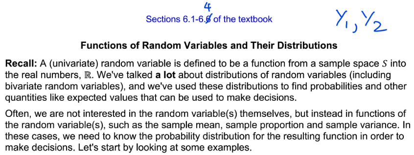

### Ex. Uniform Distribution X, Let W = 2x+4

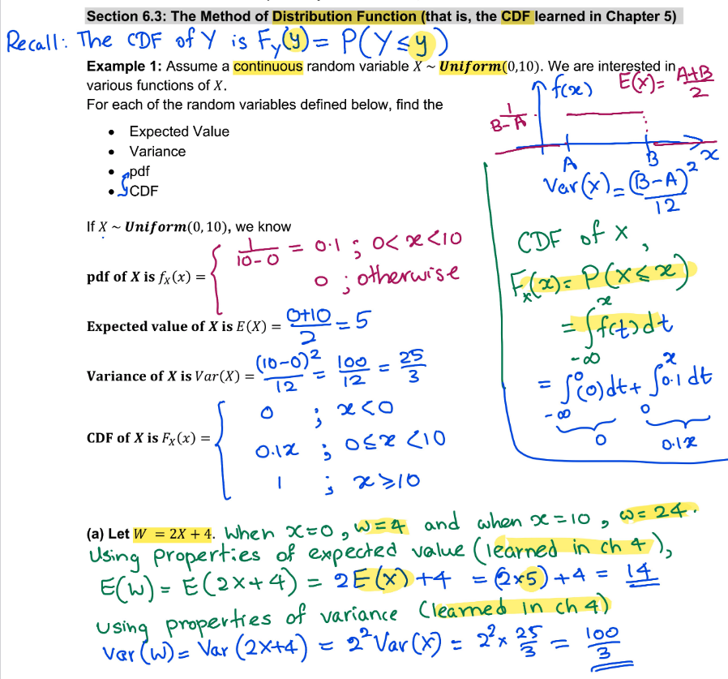

### CDF of W

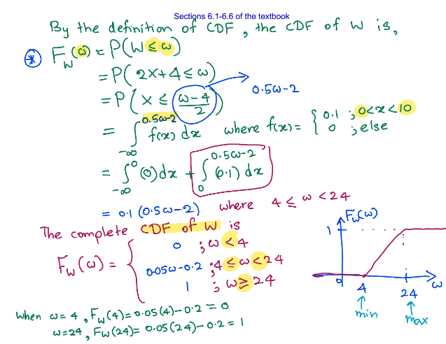

### PDF of W

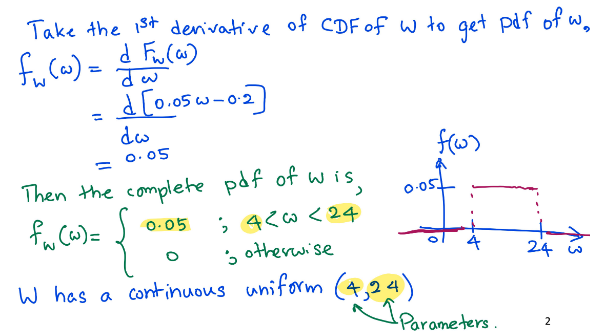

### $T=\frac{x^2}{4}+1$

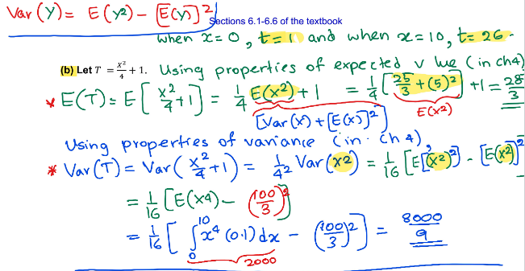

### CDF and PDF of T

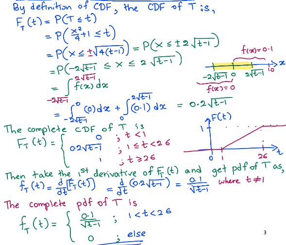

# W6D12: Feb. 10th, 2022

### Ex. R=ln(X)

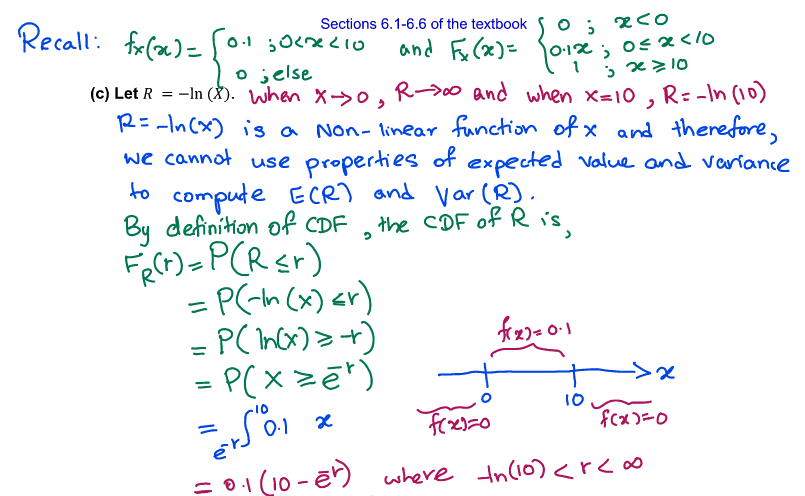

### CDF and PDF of R

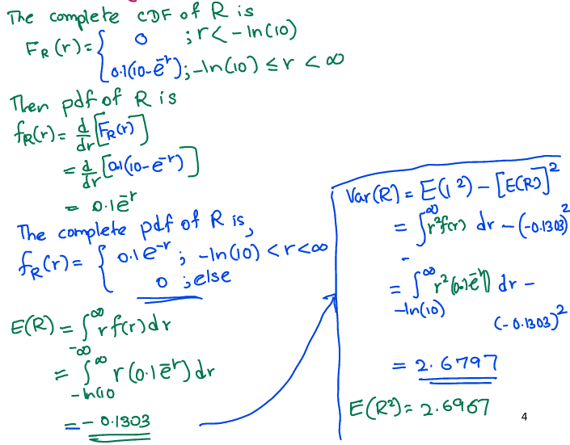

### Univariate Transformations Using CDF's

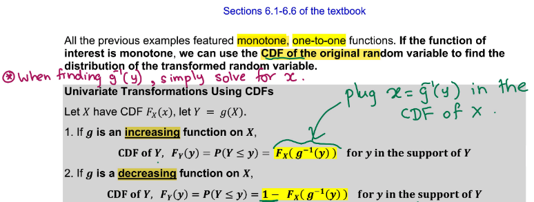

### Uniform X and $T=\frac{x^2}{4}+1$

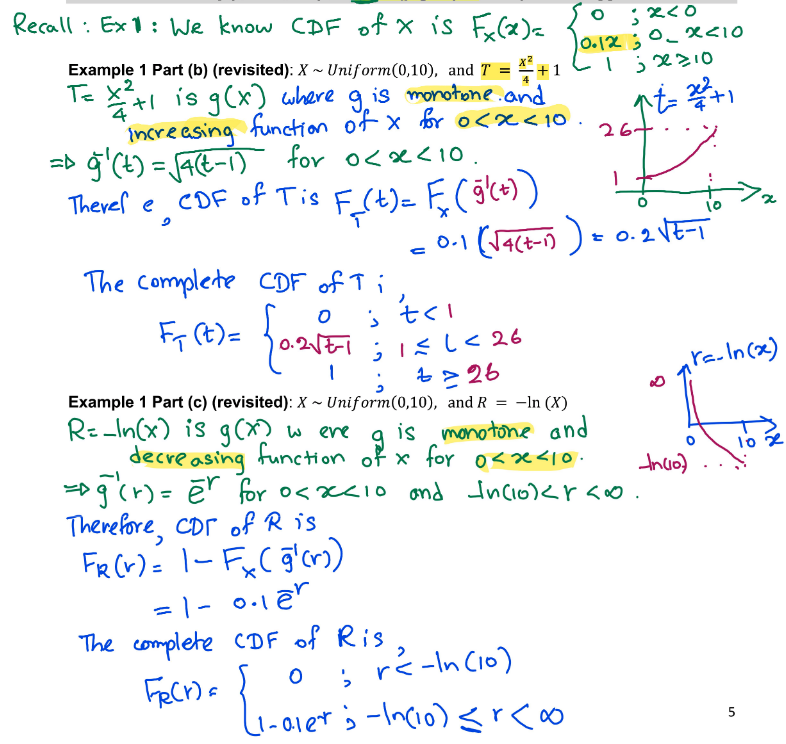

### Increasing vs. Decreasing functions

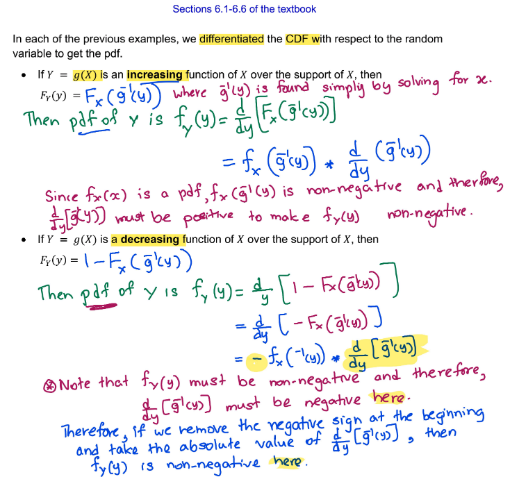

### Method of Transformations


### Ex. Find the pdf of $Y=e^{x}$ and $Z=\frac{1}{X}$

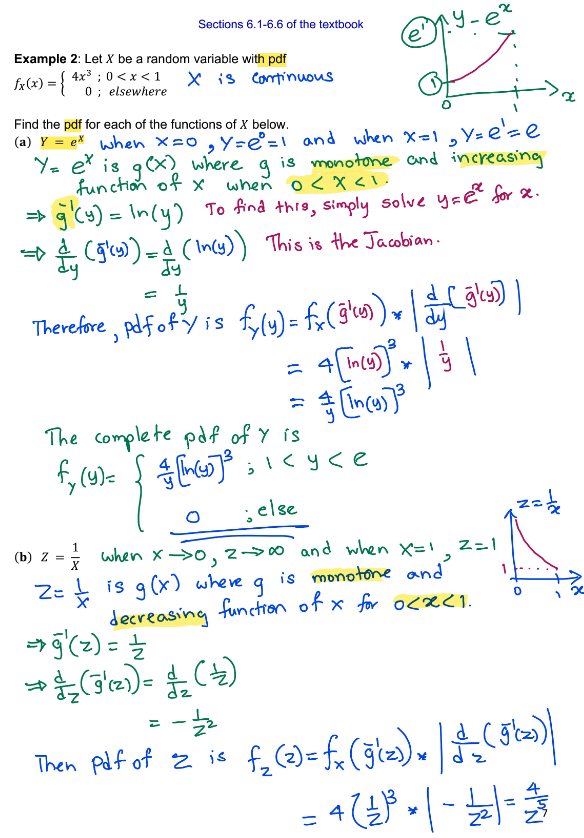
### Complete pdf of Z

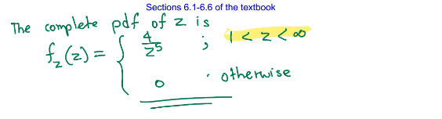

# W7D13: Feb. 15th, 2022

### Find the pdf of $Y=3X$

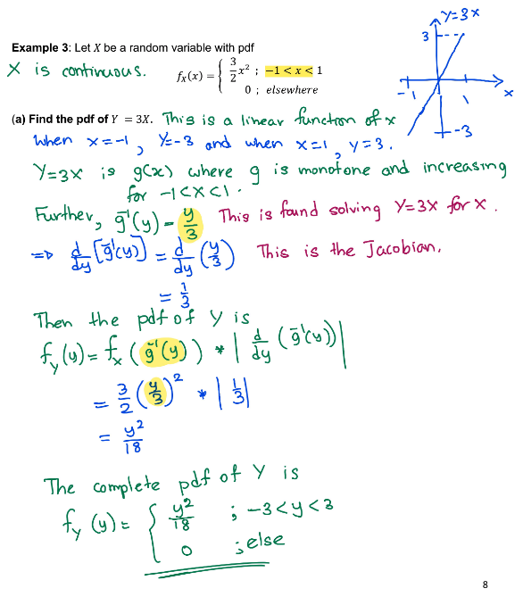

### Find the pdf of $Y=X^2$

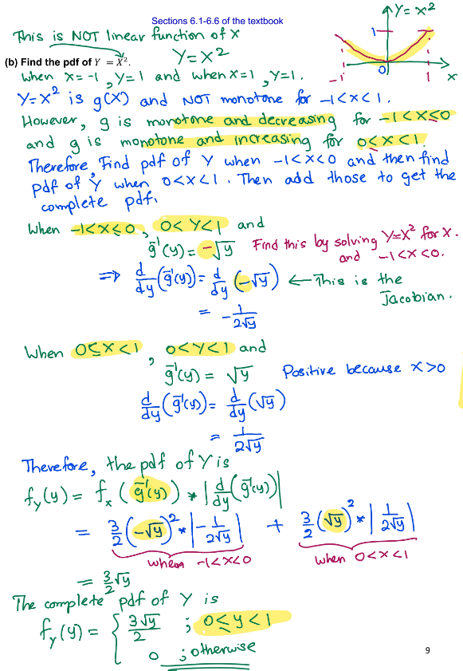

### Bivariate Transformations using Jacobians

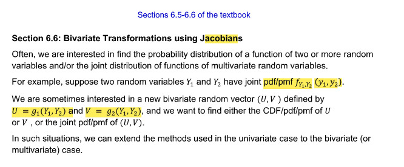

### Ex. Total Volume Shipped

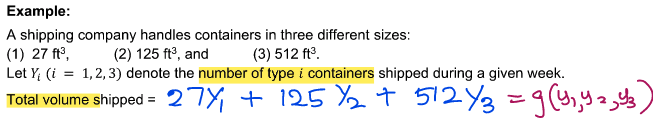

### Ex. Revenue from sales

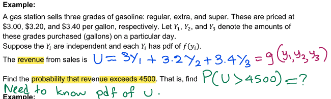

### Ex. Difference in efficiency between economy and name-brand gas

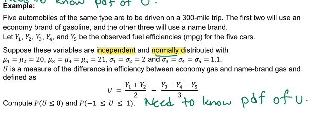

### Ex. Uniform Distribution 

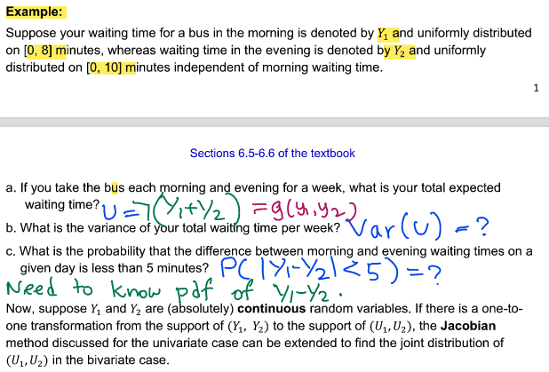

### Bivariate Transfomations for Continuous rv using Jacobian

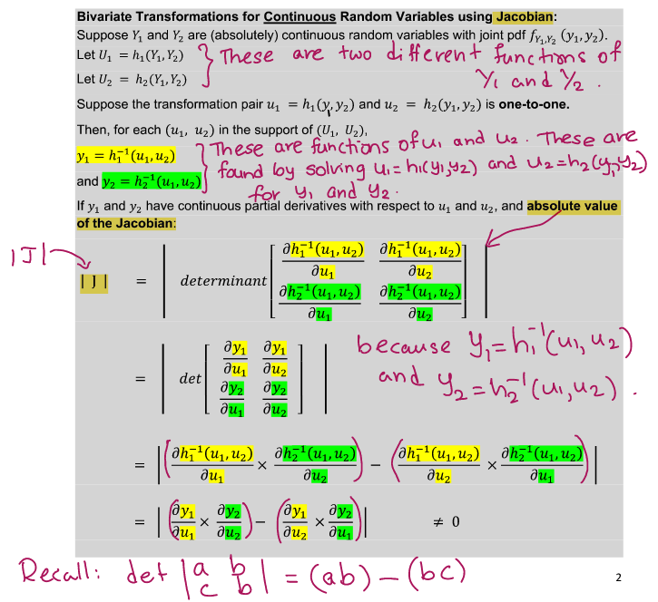

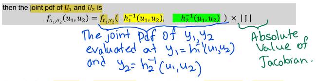

### Find joint pdf of $U_1$ and $U_2

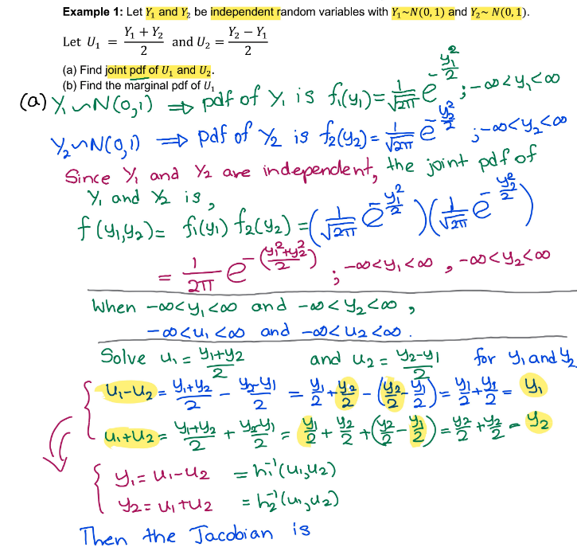

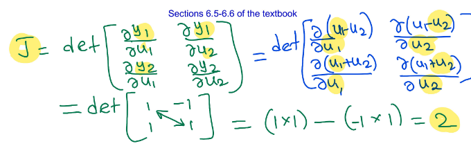

# W7D14: Feb. 16th, 2022

# W8D15: Feb. 22nd, 2022

# W8D16: Feb. 24th, 2022

# W9D17: Mar. 1st, 2022

# W9D18: Mar. 3rd, 2022

# W10D19: Mar. 8th, 2022

# W10D20: Mar. 10th, 2022

# W11D21: Mar. 15th, 2022

FINAL!!!


