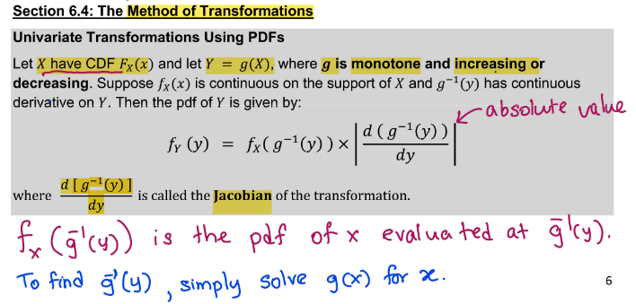
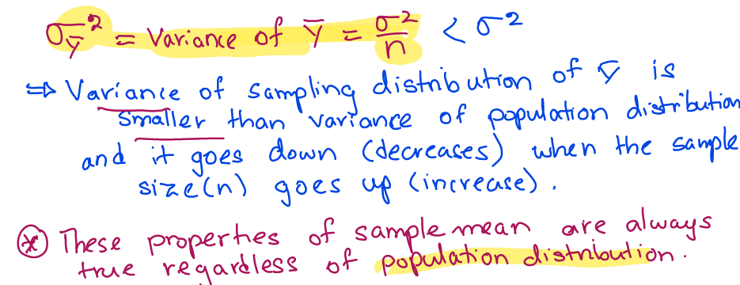

# W6D11: Feb. 8th, 2022 

## Functions of Random Varibales and Their Distributions

### Ex. Uniform Distribution X, Let W = 2x+4

### CDF of W

### PDF of W

### $T=\frac{x^2}{4}+1$

### CDF and PDF of T

# W6D12: Feb. 10th, 2022

### Ex. R=ln(X)

### CDF and PDF of R

### Univariate Transformations Using CDF's

### Uniform X and $T=\frac{x^2}{4}+1$

### Increasing vs. Decreasing functions

### Method of Transformations

### Ex. Find the pdf of $Y=e^{x}$ and $Z=\frac{1}{X}$

### Complete pdf of Z

# W7D13: Feb. 15th, 2022

### Find the pdf of $Y=3X$

### Find the pdf of $Y=X^2$

### Bivariate Transformations using Jacobians

### Ex. Total Volume Shipped

### Ex. Revenue from sales

### Ex. Difference in efficiency between economy and name-brand gas

### Ex. Uniform Distribution 

### Bivariate Transfomations for Continuous rv using Jacobian

### Find joint pdf of $U_1$ and $U_2

# W7D14: Feb. 17th, 2022

### Joint PDF of $U_1$ and $U_2$ and PDF of $U_1$

### Exponential $Y_1$ and $Y_2$, Let $U_1=\frac{Y_1}{Y_2}$

### The joint pdf of $U_1$ and $U_2$

### Marginal PDF of $U_1$

# W8D15: Feb. 22nd, 2022

## 6.5 The Method of Moment-Generating Functions

### Distributions, mgf, pmf or pdf

### Theorem 1

### Example 3

### Example 4

### Theorem 6.2: MGF of sum of independent rv

### Example

# W8D16: Feb. 24th, 2022

### Theorem 6.3 

### Example 6

## Sampling Distributions and the Central Limit Theorem 

### Random Sample

# W9D17: Mar. 1st, 2022

### Example 1

### Definition 7.1: Statistic 

### Definition: Sampling Distribution 

### Example 2

## 7.2 Sampling from the Normal Distribution 

# W9D18: Mar. 3rd, 2022

### Example 3

### Example 4

### Theorem 7.3

### Definition 4.10 and Theorem 7.2

### TI Caclulator instructions and Example 5

# W10D19: Mar. 8th, 2022

# W10D20: Mar. 10th, 2022

# W11D21: Mar. 15th, 2022

FINAL!!!

