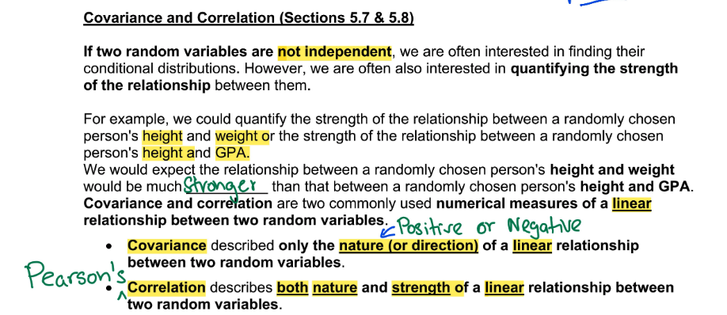

# **W1D1: Jan. 4th, 2022** 

## About Class

- PHd in Statistics from Idaho

- Homework Due on Friday, and will be graded over the weekend. 

- Starting with Chapter 5.

- Class notes are in Canvas

### 461 Last Lecture Notes

#### Joint CDF and PDF

CDF for two random variables have 3 properties

- smallest value is 0

- largest value is 1

- always non-decreasing 

Joint PMF for discrete variables uses summation and has two properties

- all probability are between 0 and 1

- total probability must be 1

## Example: Two-way Table 

Two way tables, because there are two ways to read it 

- also known as pivot table and contingency table

- make sure you can write and understand in different ways

### a) P(Only 1 car will be sold)

### b) P(1 warrenty will be sold given that 2 cars were sold on a given day)

### c) Find and report the marginal pmf of $Y_1$

"O otherwise" must be included for a complete distribution function. 

### d) Are $Y_1$ and $Y_2$ independent? 

# **W1D2: Jan. 6th, 2022**

Review Homework will be Homework 1 and due Friday 14th 

## Joint PDF 

Properties :

1. smallest value is 0 

2. total volume under the joint pdf is 1

Notes : 

If the limits are given without equal sign then you can apply integral in the same way. 

## Example : Joint pdf

### a) Draw and shade the support

The support is the area on the graph. 

Upper limit is only important for PMF of discrete random variables 

- pdf : $f_{Y_1,Y_2}\geq0$

- PMF : $0\leq p(y_1,y_2)\leq 1$

### b) Verify $f(y_1,y_2)$ is a valid joint pdf

### c) Find the joint CDF 

CDF : $F(y_1,y_2)=P(Y_1\leq y_1, Y_2\leq y_2)=\int_{-\infty}^{y_2}\int_{-\infty}^{y_1}f(y_1,y_2)dt_1dt_2$

- when we do problems we do not need to write every step of the integral 

- pay attention to the limits on the double integral ($y_1$ is on the inner integral, meaning it is integrated first ($dt_1$ inside $dt_2$))

- final answer will be a function, not a limit  

- lowest value must be 0, and highest value must be 1 

  - 0 otherwise is wrong without values for 1 included in CDF
  
- when you find the cdf you must use $dt_1$ and $dt_2$, but don't need it to use or solve for probabilities 

### d) P(Both variables are less than 1/4)

### e) P($Y_1$ is more than 0.75)

# **W2D3: Jan. 11th, 2022**

 

# **W2D4: Jan. 13th, 2022**

# **W3D5: Jan. 18th, 2022**

joint pmf (p) : between 0 and 1

joint pdf (f) : nonnegative 

Discrete uses summation 

# **W3D6: Jan. 20th, 2022**

# **W4D7: Jan. 25th, 2022**

# **W4D8: Jan. 27th, 2022**

# **W5D9: Feb. 1st, 2022**

MIDTERM 

# **Extra Credit** 

